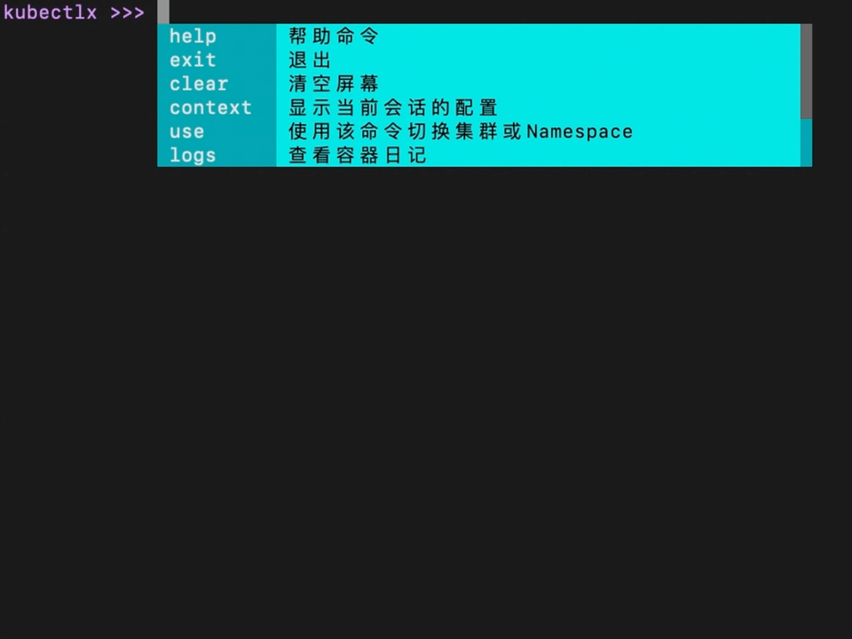
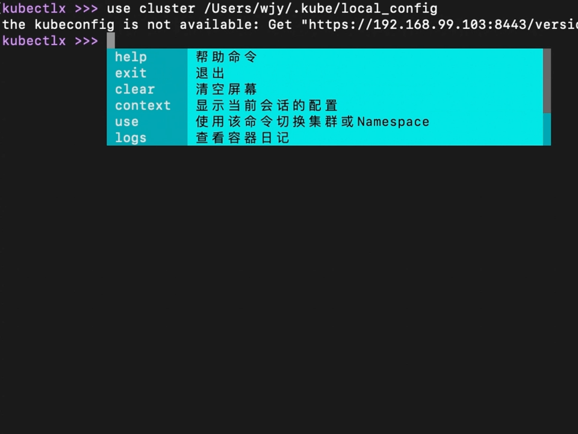
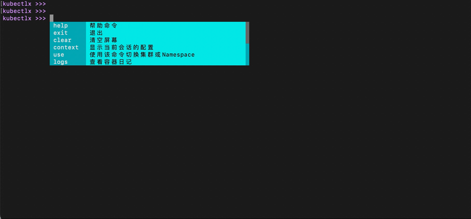
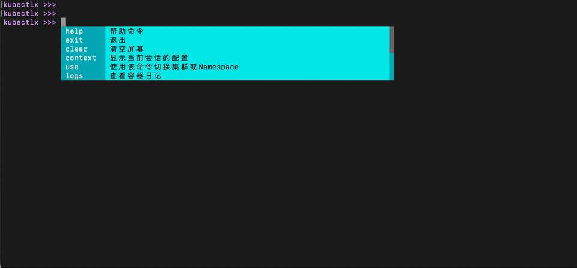

# kubectlx

kubectlx是一款基于go-prompt库开发的k8s命令行工具，目的是简化kubectl工具的一些常用命令的使用，
并提供命令输入提示、自动补全。[下载](https://www.k8syaml.cn/kubectlx)


## 支持多k8s集群
1. 可通过启动参数指定会话连接的k8s集群
```shell
kubectlx --kubeconfig=~/.kube/my_k8s_cluster_config
```

2. 在kubectlx进程中使用use命令切换集群，例如：
```shell
kubectlx >>> use cluster ~/.kube/my_k8s_cluster_config
success
```


## 支持会话默认namespace
进程中可以指定默认的namespace，减少每条命令都输入`-n <namespace>`，并且可以切换namespace。
默认namespace为"default"。
可以使用use命令切换namespace，例如：
```shell
kubectlx >>> use namespace xx
success
```



## 查询当前选择的k8s集群和namespace
如果忘记了当前kubectlx进程选择的是哪个k8s集群，或者哪个namespace，可以使用context命令查看。
例如：
```shell
kubectlx >>> context
use cluster: /Users/wjy/.kube/config
use namespace: default
```


## 退出和清屏
退出kubectlx进程
```shell
kubectlx >>> exit
```
清空屏幕
```shell
Bye!
Exiting.
```

## 使用帮助命令
使用help查询kubectl支持的命令，例如：
```shell
kubectlx >>> help
System Command:
  exit  退出
  clear 清空屏幕
Context Command:
  context       显示当前会话的配置
  use   使用该命令切换集群或Namespace
Kube Command:
  logs  查看容器日记
  get   资源查询
  delete        删除资源
  apply 通过yaml文件来创建或更新Kubernetes资源对象
  edit  编辑资源
......省略
```
还可以使用'-h'或者'-help'查看子命令的帮助文档，例如：
```shell
kubectlx >>> get pods -h
pods:
  (POD_NAME)    回车查看所有pod，或指定pod名称可查看指定pod
  flags:
  -h    查看当前命令帮助文档
  -help 查看当前命令的帮助文档
  options:
    -A  扫描所有Namespace
    -o  输出格式：json|yaml|wide，例如：-o yaml
```


## 扩展的命令
除了支持常用的kubectl支持的命令外，kubectlx还扩展了一些命令应对常见的工作场景需求。
1. 查询资源的状态，资源名称支持前缀模糊搜索
```shell
kubectlx >>> status <资源类型> <资源名称> [options]
Results:
  Type: pods
- ResName: <资源名称> 
    Status:
      状态信息
```

2. 查询资源树，不支持自定义资源
```shell
kubectlx >>> tree <资源类型> <资源名称>
```
例如：
```shell
kubectlx >>> tree jobs xxx
jobs    xxx  Complete
  |----pods     yyy    Succeeded
```

3. 简化事件查询命令
```shell
kubectlx >>> tree <资源类型> <资源名称>
```
例如：
```shell
event pods xxxx
LAST SEEN     TYPE     REASON      OBJECT         MESSAGE
76s          Normal    Parsed     pods/xxxx      xxxxxxxxxxx
```

4. 资源有Finalizers，而可能某些Finalizers有问题，导致无法删除，通过--force强制删除也无法删除，需要先移除所有的Finalizers，才能删除，
为了简化这个步骤，kubectlx提供一个扩展命令来实现真正的强制删除
```shell
kubectlx >>> forcedel <资源类型> <资源名称>
```

5. 明文显示Secret资源
```shell
secret show secret资源名称
```
支持参数：
* -o：指定输出格式，支持json|yaml，默认为yaml 
* --show-data=true：只输出data
例如：
```shell
kubectlx >>> secret show variable-xxx --show-data=true
TF_VAR_alb_name: chenyuntest
TF_VAR_is_internal: "true"
.......
```